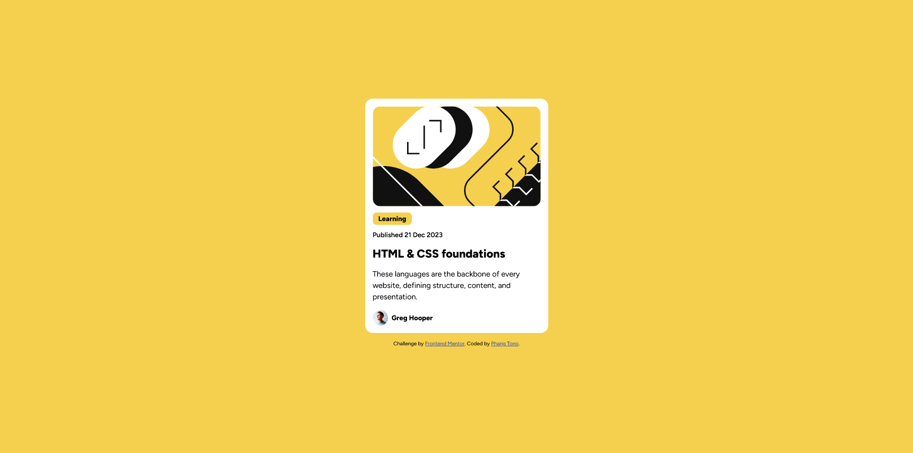

# Frontend Mentor - Blog preview card solution

This is a solution to the [Blog preview card challenge on Frontend Mentor](https://www.frontendmentor.io/challenges/blog-preview-card-ckPaj01IcS). Frontend Mentor challenges help you improve your coding skills by building realistic projects. 

## Table of contents

- [Overview](#overview)
  - [The challenge](#the-challenge)
  - [Screenshot](#screenshot)
  - [Links](#links)
- [My process](#my-process)
  - [Built with](#built-with)
  - [What I learned](#what-i-learned)

## Overview

### The challenge

Users should be able to:

- See hover and focus states for all interactive elements on the page

### Screenshot



### Links

- Solution URL: [Add solution URL here](https://your-solution-url.com)
- Live Site URL: [Add live site URL here](https://your-live-site-url.com)

## My process

### Built with

- HTML5
- CSS
- Flexbox
- Grid

### What I learned

I learned to organize layouts with flexbox and grid.
So that <card__tag> can be in the background according to the design, I added <span>, and I used :hover selector to select elements when you mouse over them. And for the font because it is available when downloading, I used font-face in coding this time

```html
<div role="card" class="card">
  
  <div role="cardtag" class="card__tag"><span>Learning</span></div>
  <div role="carddate" class="card__date">Published 21 Dec 2023</div>
  <div role="cardtitle" class="card__title">HTML & CSS foundations</div>
  <div role="carddescription" class="card__description">These languages are the backbone of every website, defining structure, content, and presentation.</div>
  <div role="cardauthor" class="card__author">
    Greg Hooper</div>
</div>
```
```css

@font-face {
    font-family: 'figtree-italic';
    src: url('assets/fonts/Figtree-Italic-VariableFont_wght.ttf') format('truetype');
}

@font-face {
    font-family: 'figtree';
    src: url('assets/fonts/Figtree-VariableFont_wght.ttf') format('truetype');
}
.card__tag span{
    background-color: var(--primary-yellow);
    font-size: .9rem;
    font-weight: 800;   
    padding: .25rem .75rem;
    border-radius: .5rem;
}
.card__title:hover{
    color: var(--primary-yellow);
    cursor: pointer;
}
```"# blog-preview-card" 
